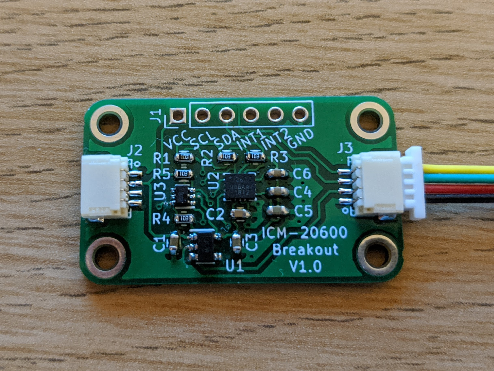
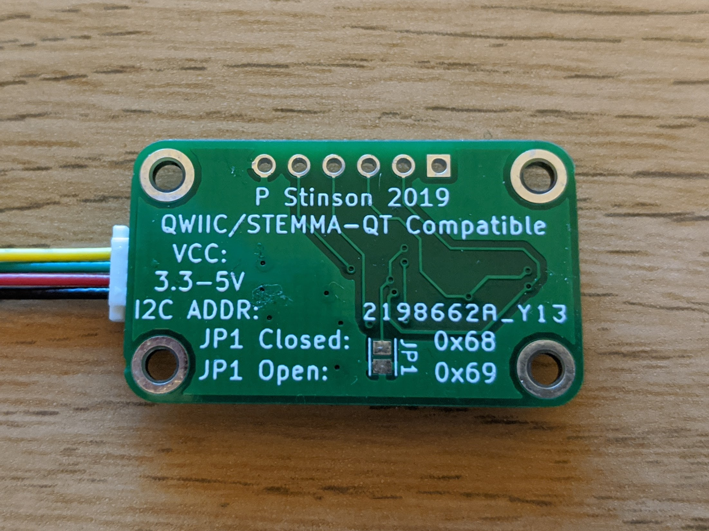

# icm-20600-breakout-pcb
Breakout board for the ICM 20600 3-axis Accelerometer and Gyroscope.

This board allows for use of the ICM 20600 3-axis Accelerometer + 3-axis Gyroscope, from TDK InvenSense, with both 3.3 and 5V microcontroller development boards. The sensor is powered by an onboard, low-dropout 1.8V regulator and level shifting circuitry is included for the SDA and SCL lines. As well as a 0.1 inch header for use on a bread-board, two JST-SH connectors are provided which are compatible with the Sparkfun Qwiic and Adafruit StemmaQT standards. These connectors allow for chaining of the board with other compatible boards.

Also included in the repository is a basic example for reading the sensor and configuring its measurement ranges from an Arduino Uno or similar microcontroller board. This prints readings to the USB serial port and a processing sketch is included that visualises data from two of the accelerometer axis (see above image).

